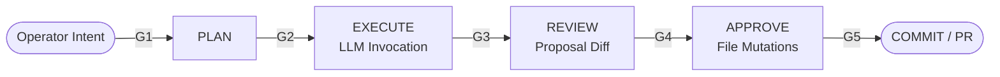

# Cosmocrat Operator

> **Cosmocrat Operator** — Governed operator plane for AI-executed code.


---

**Status:** Phase 1 Complete · `v0.2.0-p1`
**Architecture:** User space / cockpit for Cosmocrat AI Operating System

## Overview

Cosmocrat Operator is the **human-in-the-loop interface** for the Cosmocrat AI Operating System. It replaces autonomous AI coding workflows with a governed **PLAN → EXECUTE → REVIEW → APPROVE** pipeline.

Every action is:
- **Receipt-logged** to an append-only Chronicle
- **Gate-controlled** with explicit human approval
- **Isolated** in per-task git worktrees

## Positioning

Most coding agents optimize for velocity: autonomous execution by default, human review on the back end. Cosmocrat Operator inverts the default. Every state mutation passes through a server-enforced approval gate before it ships. **Gate-first, autonomous-never.**

| Pattern              | Default Mode (Claude Code · Cursor · Aider · Continue) | Cosmocrat Operator                              |
| -------------------- | ------------------------------------------------------ | ----------------------------------------------- |
| Execution            | Autonomous-first, review optional                       | Gated-first, autonomous-never                   |
| State mutation       | Direct write, log after                                 | Pre-execution gate, append-only Chronicle       |
| Tool use             | Implicit                                                | Explicit operator approval per call             |
| Recovery from drift  | Manual rollback                                         | Server-enforced halt                            |

This is the runtime governance pattern for environments where the cost of an unauthorized mutation is higher than the cost of a slower review cycle.

## Architecture

```
pandora/
├─ cosmocrat-core       ← kernel / brain
├─ cosmocrat-operator   ← user space / cockpit (this repo)
└─ operator-plane       ← adapter API bridge
```

## Human-in-the-Loop Gates



| Gate | Blocks Until                                  |
| ---- | --------------------------------------------- |
| G1   | Intent submitted by operator                  |
| G2   | Operator clicks Execute (LLM invocation)      |
| G3   | Operator reviews proposal                     |
| G4   | Operator approves file mutations              |
| G5   | Operator approves commit / PR                 |

**No autonomous execution path exists. All gates are server-enforced.**

## Quick Start

```bash
# Terminal 1: Start adapter
cd operator-plane
export COSMOCRAT_GATEWAY_URL=http://edge-01:8000
export COSMOCRAT_CCA_TOKEN=<your-token>
python -m uvicorn adapter.server:app --port 8081

# Terminal 2: Start UI
cd cosmocrat-operator/frontend
pnpm install
npx vite
```

Open `http://localhost:5173` → Submit Intent → Execute → Review → Approve

## Key Components

- **OperatorPlanePanel** - Main cockpit interface
- **IntentForm** - G1 Intent submission
- **GateStatus** - Visual gate indicators
- **ExecutionControls** - G2/G4 action buttons
- **ChronicleDiffViewer** - G3 proposal review

## Operator-Plane Constraints

Cosmocrat Operator is the **gated execution surface** for the broader Cosmocrat AI Operating System. The kernel (`cosmocrat-core`) composes autonomous primitives — MCP servers, multi-agent orchestration, background workers — to do real work. This plane enforces explicit human approval before any of those primitives mutate production state.

The following autonomous patterns are quarantined *in the operator plane* by design:

- ❌ Direct executor invocation — must pass through gates G2 / G4
- ❌ Implicit MCP server / client invocation — gated; explicit approval required per call
- ❌ Chat command bar — no implicit-action interface surface
- ❌ Auto task generation — operator submits intent at G1
- ❌ Background agents — no plane-local autonomous execution path
- ❌ Tab autocomplete — gated against silent mutation surfaces

These are not philosophical positions against autonomous AI. They are the enforcement contract of *this layer*. Cosmocrat as a whole composes MCP servers (`Serena`, `Cognee`, custom-built), multi-agent orchestration, and autonomous workflows; the operator plane is the gate they pass through before mutating production state.

## Attribution

This project includes UI components derived from [BloopAI/vibe-kanban](https://github.com/BloopAI/vibe-kanban) under the Apache License 2.0. See [NOTICE.md](NOTICE.md) for details.

## Critical Rule

> **If it bypasses Chronicle or a gate, it does not ship.**

---

*Cosmocrat Operator v1 — 2026-01-13*
